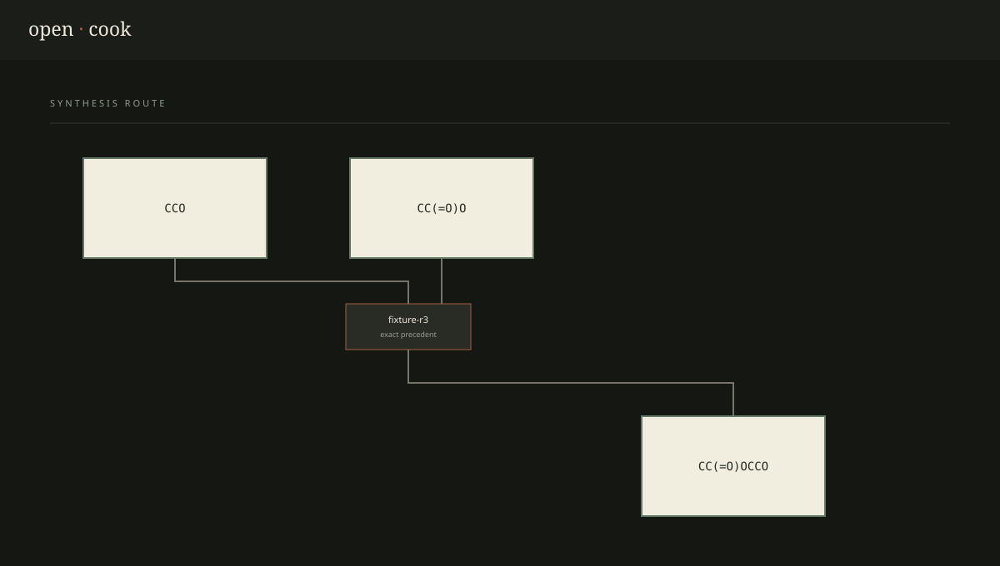

# OpenCook

**An open-source search engine for chemical synthesis.**

Search is evidence-first: OpenCook exhausts exact ORD producers at each unresolved molecule before an
optional local RetroChimera model proposes a computational bridge. Model-generated transformations are
never presented as experimental precedent.

OpenCook searches indexed reaction records backward from a molecular target, constructs an AND/OR synthesis graph, terminates branches at configured stock, and returns connected, ranked routes with evidence and provenance. It is deterministic, local-first scientific software—not an LLM application.

For evidence-based public availability, OpenCook integrates with the independent
AvailEvidence service. Availability checks are explicit and create versioned local
stock snapshots; the planner never guesses sourceability from molecular complexity.



## Quick start

```bash
uv sync --extra dev
uv run opencook doctor
uv run opencook search "CC(=O)OCCO"
uv run opencook serve
```

Open <http://127.0.0.1:8000/docs> for the API. For the web application:

```bash
cd web
npm install
npm run dev
```

The bundled benign fixture is intentionally tiny and requires no network. See [data documentation](docs/data.md) for ORD, [search internals](docs/search.md), and [limitations](docs/architecture.md#limitations).

## CLI

```bash
opencook doctor --json
opencook data list
opencook data import data/fixtures/reactions.json --database local.sqlite
opencook search "CC(=O)OCCO" --json
opencook benchmark --iterations 100 --json
```

## Development

```bash
uv run ruff check .
uv run mypy
uv run pytest --cov=opencook
cd web && npm test && npm run build
```

Source code is Apache-2.0. Dataset licenses remain separate; see [DATA_LICENSES.md](DATA_LICENSES.md).
