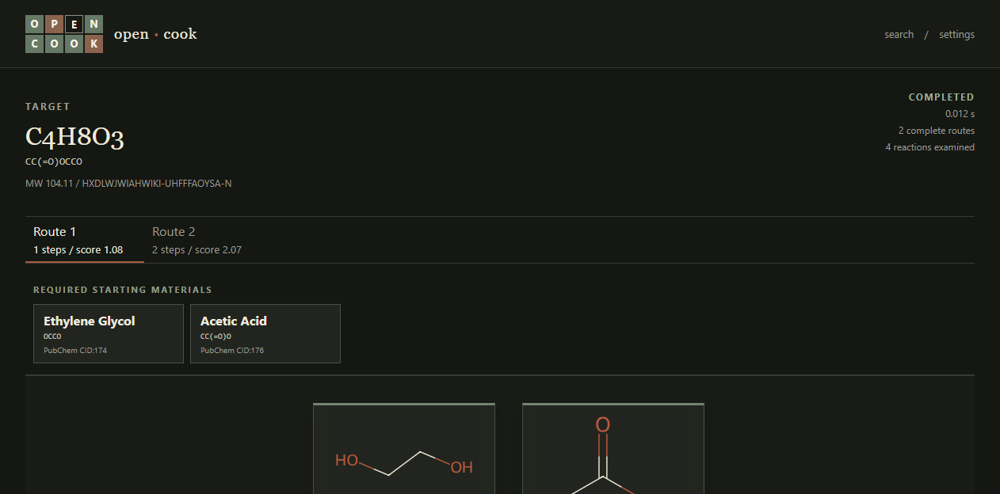

# OpenCook

**An open-source search engine for chemical synthesis.**

[](https://github.com/idreesaziz/OpenCook/actions/workflows/ci.yml)
[](https://www.python.org/)
[](https://www.rdkit.org/)
[](LICENSE)

Give OpenCook a molecular structure. It searches backward through experimental reaction records, builds an
AND/OR synthesis graph, and returns ranked, connected routes to available starting materials. Every
transformation retains its evidence class and provenance.



OpenCook is local-first scientific software, not an LLM wrapper. It never silently presents a computational
proposal as experimental precedent.

## What works in v0.1

- SMILES, InChI, MOL/SDF, paste, and graphical input through Ketcher
- RDKit normalization, identity, descriptors, fingerprints, and deterministic SVG depictions
- streaming ORD Parquet and Protobuf ingestion with rejection reports and provenance
- indexed product-to-reaction lookup designed for million-reaction corpora
- best-first AND/OR search plus a breadth-first baseline
- convergent routes, transposition reuse, cycle rejection, route ranking, and partial-route recovery
- exact experimental and explicitly labelled computational RetroChimera expansions
- live search traces, cancellation, route comparison, and evidence inspection
- optional purchase-directed search through [AvailEvidence](https://github.com/idreesaziz/AvailEvidence)
- versioned REST API, CLI, Docker setup, tests, and benchmark harness

## Try it locally

Prerequisites: [uv](https://docs.astral.sh/uv/), Node.js 20+, and Git.

```bash
git clone https://github.com/idreesaziz/OpenCook.git
cd OpenCook
uv sync --extra dev
uv run opencook doctor
uv run opencook search "CC(=O)OCCO"
uv run opencook serve
```

In another terminal:

```bash
cd web
npm ci
npm run dev
```

Open <http://127.0.0.1:5173>. The bundled benign fixture works without a network connection or a large
download. API documentation is available at <http://127.0.0.1:8000/docs>.

## Search a real ORD corpus

Reaction datasets are downloaded separately and retain their own licenses.

```bash
uv sync --extra ord
uv run opencook data download ord_dataset-IDENTIFIER --output data/downloads
uv run opencook data import-ord data/downloads/DATASET.parquet
uv run opencook doctor
```

See [reaction data](docs/data.md) for dataset selection, resumable imports, licensing, and stock catalogs.

## Optional local model fallback

OpenCook always queries indexed experimental producers first. If none exist, an explicitly enabled local
RetroChimera provider may propose a disconnection. Its output remains labelled
`computational_proposal` and does not become experimental evidence.

```powershell
uv venv .model-venv --python 3.11
uv pip install --python .model-venv\Scripts\python.exe retrochimera==1.2.0
$env:OPENCOOK_MODEL_PROVIDER = "retrochimera"
$env:OPENCOOK_MODEL_PYTHON = ".model-venv\Scripts\python.exe"
uv run opencook serve
```

The complete compatible model environment is documented in [search internals](docs/search.md).

## Architecture

```text
structure input
      |               exact match             AND/OR search
      +-> RDKit normalization -> reverse index -----------> ranked routes
                                      |                         |
                                      +-> local model fallback  +-> provenance
                                                                +-> SVG graph
                                                                +-> availability evidence
```

The backend is a typed Python modular monolith using RDKit, SQLite, FastAPI, and Typer. The React/TypeScript
frontend contains presentation logic only. Large corpora and generated indexes are never committed to Git.

Read [architecture](docs/architecture.md), [search](docs/search.md), [normalization](docs/molecular-normalization.md),
[scoring](docs/scoring.md), and [benchmarks](docs/benchmarks.md).

## CLI

```bash
opencook doctor --json
opencook data list
opencook stock import catalog.smi.gz --source SOURCE --version VERSION
opencook search "CC(=O)OCCO" --routes 10 --max-depth 12 --json
opencook benchmark --iterations 100 --json
```

## Scientific boundaries

OpenCook finds evidence-supported graph paths; it does not guarantee feasibility, yield, selectivity, safety,
or regulatory acceptability. Availability evidence is not a statement of purity. Computational proposals are
reported separately from experimental records. If no defensible route is found, OpenCook says so.

## Contributing

Bug reports, dataset adapters, benchmark cases, search improvements, and chemistry review are welcome. Start
with [CONTRIBUTING.md](CONTRIBUTING.md) or open a focused issue. Please do not submit proprietary reaction
records or data you lack permission to redistribute.

```bash
uv run ruff format --check .
uv run ruff check .
uv run mypy
uv run pytest --cov=opencook
cd web && npm run lint && npm test && npm run build
```

OpenCook source is MIT licensed. Reaction corpora, model checkpoints, generated indexes, catalogs, and
user-provided data keep their separate terms; see [DATA_LICENSES.md](DATA_LICENSES.md).
